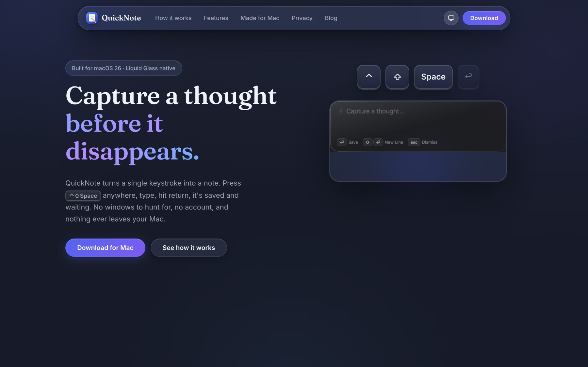
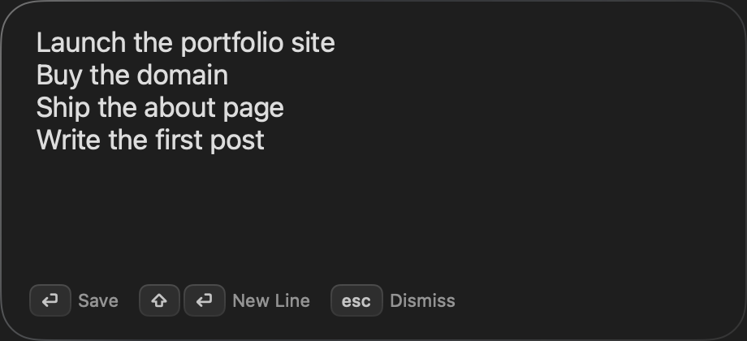

<div align="center">


# QuickNote, Website

**The marketing site for [QuickNote](https://github.com/mohdhadi01/QuickNote-Mac)**,
a native macOS instant-notes utility. Built with Next.js, statically exported,
zero trackers.

[](https://github.com/mohdhadi01/QuickNote-Mac-Website)
[](https://github.com/mohdhadi01/QuickNote-Mac-Website)
[](https://github.com/mohdhadi01/QuickNote-Mac/releases/latest)



The capture panel it advertises, straight from the app:



Every product visual on the site is a **real screenshot of the app**, captured
with the app's own snapshot tooling and curated demo notes, see the
[`-quicknote.demoData`](https://github.com/mohdhadi01/QuickNote-Mac) hook in the
app repo.

</div>

## What's on the site

- **Hero with a looping capture demo**, keycaps press, the glass capture panel
  appears, a note is typed, Return saves it, and the note appears in the app
  window (all real screenshots, animated with transform/opacity only).
- **How it works**, the three-second shortcut → thought → saved story.
- **Showcase & bento features**, the app's main window plus search, keyboard,
  multi-select/merge, and drag-and-drop highlights.
- **Made for Mac, Privacy, Download**, native identity, local-only promise,
  and the real DMG shipped with the site.
- **Blog**, four keyword-targeted articles grounded in
  [product truth](content/product-truth.md).

## Structure

```
.
├── app/
│   ├── layout.tsx            # shared nav/footer, SEO metadata, theme bootstrap
│   ├── page.tsx              # landing page (hero, how it works, features, privacy, download)
│   ├── globals.css           # design system: light/dark, glass, animations, blog styles
│   ├── blog/page.tsx         # blog index
│   ├── blog/[slug]/page.tsx  # post pages (static, from content/posts/*.md)
│   ├── sitemap.ts            # → /sitemap.xml
│   ├── robots.ts             # → /robots.txt
│   └── manifest.ts           # → /manifest.webmanifest
├── components/               # Nav, Footer, MacWindow, ClientEffects (theme/reveal/hero)
├── content/
│   ├── product-truth.md      # feature truth table, READ before editing copy
│   ├── screenshots-MANIFEST.md
│   └── posts/*.md            # blog posts (frontmatter: title, description, date, keywords)
├── lib/
│   ├── site.ts               # site URL, titles, download path, verification token
│   └── posts.ts              # markdown loading (gray-matter + marked, build-time only)
├── public/
│   ├── assets/screenshots/   # real captures from the app (demo notes only)
│   ├── assets/icon/          # app icon exports
│   └── assets/og/og.png      # 1200×630 social share image
└── scripts/                  # headless-Chrome screenshot QA
```

## Develop

```
npm install
npm run dev        # → http://localhost:3000
```

## Build & preview

```
npm run build      # static export → out/
npx serve out      # or: python3 -m http.server -d out 8080
```

`out/` is a fully static site, deploy it anywhere.

## Deploy

Pick one:

- **Vercel** (native fit): import the repo. Framework preset Next.js, no other
  settings. Set `NEXT_PUBLIC_SITE_URL` to your domain.
- **Netlify / Cloudflare Pages**: build command `npm run build`, publish
  directory `out`.
- **GitHub Pages**: enable `basePath` in `next.config.ts`
  (e.g. `"/QuickNote-Mac-Website"`), push the `out/` folder to `gh-pages`.

Installs run through the Homebrew command on the site
(`mohdhadi01/tap/quicknote`). The DMG's canonical home is the app repo's
[Releases](https://github.com/mohdhadi01/QuickNote-Mac/releases/latest);
the cask downloads it from there, so this repo does not ship a binary.

## SEO checklist (what's already wired)

- Per-page `title`/`description`, canonical URLs, Open Graph + Twitter cards
  (`metadataBase` comes from `NEXT_PUBLIC_SITE_URL`, default `https://quicknote.app`
, **set it to your real domain**).
- `/sitemap.xml` (pages + posts) and `/robots.txt` generated at build.
- JSON-LD: `SoftwareApplication` (home), `Blog` (index), `BlogPosting` +
  `BreadcrumbList` (posts).
- **Google Search Console**: put your verification token in
  `NEXT_PUBLIC_GOOGLE_SITE_VERIFICATION` (env var or `lib/site.ts` default),
  then register the domain and submit `${SITE_URL}/sitemap.xml`.

## Updating screenshots

All product visuals come from the app repo (`../QuickNote`):

```
# in the app repo, captures light+dark PNGs with curated demo notes:
.build/DD/Build/Products/Debug/QuickNote.app/Contents/MacOS/QuickNote \
  -hasCompletedOnboarding 1 -quicknote.demoData -quicknote.inMemoryStore 1 \
  -quicknote.debugSnapshot
```

Copy the PNGs from the app's temp `quicknote-snapshots/` directory into
`public/assets/screenshots/` (names in `content/screenshots-MANIFEST.md`).
After a new app release, bump the `version` line in the tap repo
(`mohdhadi01/homebrew-tap`) so brew picks it up.

## Editing rules

1. **Read `content/product-truth.md` first.** Only claim features in the ✅ list.
   No sync, no tags, no mobile versions, no notarization claims.
2. Animations stay `transform`/`opacity` only; keep the
   `prefers-reduced-motion` static fallbacks working.
3. New blog post = new `.md` file in `content/posts/` (frontmatter: title,
   description, date, keywords). It appears in the index and sitemap on the
   next build.
4. Keep the stack boring: no frameworks beyond what's in `package.json`.
